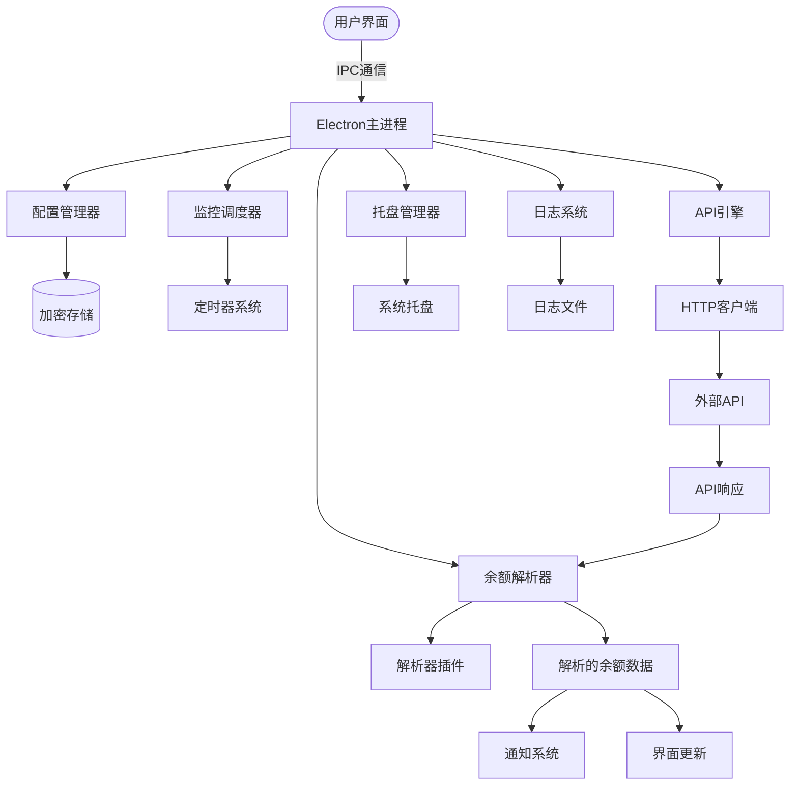

# Balance Monitor 🚀
> 专业API余额监控与警报系统 (v1.1.2)

<div align="center">
  

  <h3>您的个人API余额监控助手</h3>
  <p>实时监控、智能解析、即时通知API余额数据</p>

  <p>
    <a href="https://github.com/cherry-min/balance-monitor">
      
    </a>
    
    
    
    
  </p>

  <p>
    <a href="#-功能特性">功能特性</a> •
    <a href="#-界面概览">界面概览</a> •
    <a href="#-架构设计">架构设计</a> •
    <a href="#-安装指南">安装指南</a> •
    <a href="#-快速开始">快速开始</a>
  </p>

  <p>
    <a href="README_EN.md">English</a> |
    <strong>简体中文</strong>
  </p>
</div>

---

**Balance Monitor** 是一款专业的跨平台桌面应用程序，专为开发者、API服务提供商和依赖API配额服务的企业设计。它提供API余额数据的实时监控、智能解析和即时通知，帮助您避免因配额不足导致的服务中断。

## 🌟 功能特性 {#-功能特性}

### 1. 🎛️ 智能仪表盘与监控

* **实时余额显示**: 同时监控多个API配置，提供清晰的视觉指示
* **状态概览**: 快速查看所有监控服务，颜色编码状态指示器（活跃/非活跃/错误）
* **历史趋势**: 通过直观的图表跟踪余额变化
* **一键控制**: 单个点击即可启用/禁用特定服务的监控

### 2. 🔧 高级配置管理

* **多API支持**: 配置和监控来自不同提供商的多个API端点
* **灵活调度**: 设置从1分钟到24小时的自定义监控间隔
* **预设模板**: 流行API提供商的预配置模板（DeepSeek、Moonshot、OpenRouter、VolcEngine等）
* **安全存储**: 加密配置存储，自动备份
* **导入/导出**: 轻松在设备间迁移配置或与团队成员共享

### 3. 🧠 智能余额解析引擎

* **多格式支持**: 从JSON、XML、HTML和纯文本响应中解析余额数据
* **XPath & JSONPath**: 使用XPath解析XML/HTML，JSONPath解析JSON响应
* **插件架构**: 可扩展的解析器系统，提供供应商特定的插件
* **实时测试**: 启用监控前测试API连接和解析器配置
* **错误处理**: 智能错误检测和解析失败的优雅降级

### 4. 🔔 智能通知系统

* **系统托盘集成**: 后台监控，系统托盘图标和通知
* **多级警报**: 为警告和严重级别配置不同的警报阈值
* **自定义通知**: 为余额变化设置个性化通知消息
* **跨平台**: 在Windows、macOS和Linux系统上无缝工作
* **托盘菜单**: 从系统托盘快速访问仪表盘、配置和日志

### 5. 📊 全面的日志与分析

* **结构化日志**: 详细记录所有监控活动、API调用和解析结果
* **日志查看器**: 内置日志查看器，支持过滤、搜索和导出
* **性能指标**: 跟踪API响应时间、成功率和错误模式
* **数据导出**: 导出监控数据用于外部分析或报告

### 6. 🔐 安全与可靠性

* **加密存储**: 敏感API密钥和配置数据加密存储
* **自动备份**: 自动备份配置，防止数据丢失
* **错误恢复**: API调用失败的自动重试机制
* **资源高效**: 连续后台监控的低系统资源使用

## 🖼️ 界面概览 {#-界面概览}

### 仪表盘界面


### 服务配置界面


### 日志查看器界面


## 🏗️ 架构设计 {#-架构设计}



### 三进程架构

1. **主进程** (`src/main/`): 核心应用逻辑、系统托盘、调度、IPC处理程序
   * `config-manager.ts`: 配置CRUD操作，支持加密
   * `monitor-scheduler.ts`: 定时监控执行，定时器管理
   * `api-engine.ts`: HTTP API请求执行和测试
   * `balance-parser.ts`: 响应解析，支持XPath/JSONPath
   * `tray-manager.ts`: 系统托盘图标和上下文菜单
   * `logger.ts`: 结构化日志系统，支持日志轮转

2. **预加载脚本** (`src/preload/`): 主进程和渲染进程之间的安全桥梁
   * 向渲染进程暴露安全API
   * 类型安全的IPC通信

3. **渲染进程** (`src/renderer/`): 基于React的用户界面
   * 用于Electron API集成的React钩子
   * Zustand状态管理
   * TailwindCSS样式
   * 通过IPC实现实时数据更新

## 📥 安装指南 {#-安装指南}

### 选项A: 下载预构建二进制文件

从 [GitHub Releases](https://github.com/cherry-min/balance-monitor/releases) 下载最新版本：

* **Windows**: `.exe` 安装程序或便携版 `.zip`
* **macOS**: `.dmg` 包
* **Linux**: `.deb`、`.rpm` 或 `AppImage`

### 选项B: 从源代码构建

#### 先决条件

* Node.js 20+
* npm
* Git

#### 构建步骤

```bash
# 克隆仓库
git clone https://github.com/cherry-min/balance-monitor.git
cd balance-monitor

# 安装依赖
npm install

# 开发模式（支持热重载）
npm run dev

# 生产构建
npm run build

# 平台特定构建
npm run build:win    # Windows
npm run build:mac    # macOS
npm run build:linux  # Linux
```

## 🚀 快速开始 {#-快速开始}

### 1. 添加第一个API配置

1. 打开Balance Monitor应用程序
2. 点击"添加配置"按钮
3. 填写配置详情：
   * **名称**: API的描述性名称
   * **API端点**: 检查余额的URL
   * **请求方法**: GET或POST
   * **请求头**: 认证头（API密钥等）
   * **请求体**: POST请求的内容
   * **监控间隔**: 检查频率（例如：5分钟）

### 2. 配置余额解析器

1. 选择**解析器类型**：
   * **JSON路径**: 用于JSON响应（例如：`$.data.balance`）
   * **XPath**: 用于XML/HTML响应（例如：`//balance/text()`）
   * **正则表达式**: 用于文本响应
   * **插件**: 使用供应商特定的解析器

2. **测试解析器**：
   * 点击"测试连接"验证API连通性
   * 使用示例响应点击"测试解析器"验证解析
   * 调整解析器配置直到正确提取余额

### 3. 设置通知

1. 配置**警报阈值**：
   * **警告级别**: 余额低于此值时触发
   * **严重级别**: 需要立即行动时触发

2. 启用**系统托盘通知**：
   * 应用程序在后台运行
   * 显示系统托盘图标
   * 显示余额变化的通知

### 4. 监控多个API

1. 为每个API服务添加额外配置
2. 按供应商或用途组织配置
3. 根据需要单独启用/禁用监控
4. 在统一仪表盘上查看所有余额

## 🔌 集成示例

### 示例：监控DeepSeek API余额

```json
{
  "name": "DeepSeek API",
  "endpoint": "https://api.deepseek.com/user/balance",
  "method": "GET",
  "headers": {
    "Authorization": "Bearer YOUR_API_KEY",
    "Content-Type": "application/json"
  },
  "parser": {
    "type": "json",
    "path": "$.data.balance"
  },
  "interval": 300,  // 5分钟
  "alerts": {
    "warning": 10,
    "critical": 1
  }
}
```

### 示例：使用POST监控OpenRouter API

```json
{
  "name": "OpenRouter",
  "endpoint": "https://openrouter.ai/api/v1/auth/key",
  "method": "POST",
  "headers": {
    "Authorization": "Bearer YOUR_API_KEY"
  },
  "body": {},
  "parser": {
    "type": "json",
    "path": "$.data.credits"
  },
  "interval": 600  // 10分钟
}
```

## 📝 更新日志

### [1.1.2] - 2025-12-31

* **余额解析器插件系统**: 完全重构为插件架构
* **供应商特定解析器**: 添加了DeepSeek、Moonshot、OpenRouter、VolcEngine、PPIO和AIHubMix的插件
* **共享解析器类型**: 统一主进程和渲染进程的类型定义
* **UI增强**: 改进模板选择和供应商搜索功能
* **性能优化**: 减少内存使用，提高解析速度

### [1.0.7] - 2025-12-28

* **文档增强**: 添加全面的中文文档
* **截图**: 添加仪表盘、服务配置和日志查看器截图
* **更新系统**: 建立标准化的更新日志和发布说明系统

### [1.0.4] - 2025-12-28

* **核心API引擎**: 改进配置加密/解密逻辑
* **监控同步**: 修复监控状态同步问题
* **UI/UX优化**: 增强仪表盘和配置界面

### [1.0.3] - 2025-12-28

* **初始发布**: Balance Monitor桌面应用程序
* **核心功能**: API监控、智能解析、系统托盘通知
* **多配置支持**: 支持多个API配置
* **跨平台**: Windows、macOS和Linux支持

完整版本历史请查看 [CHANGELOG.md](doc/changelog/CHANGELOG.md)

---

## 👥 贡献者

[](https://github.com/RadishoNeo/balance-monitor/graphs/contributors)

---

<div align="center">
  <p>如果您觉得这个工具有用，请在GitHub为我们点上 ⭐️！</p>
  <p>版权所有 © 2025 Balance Monitor 团队。</p>
</div>
