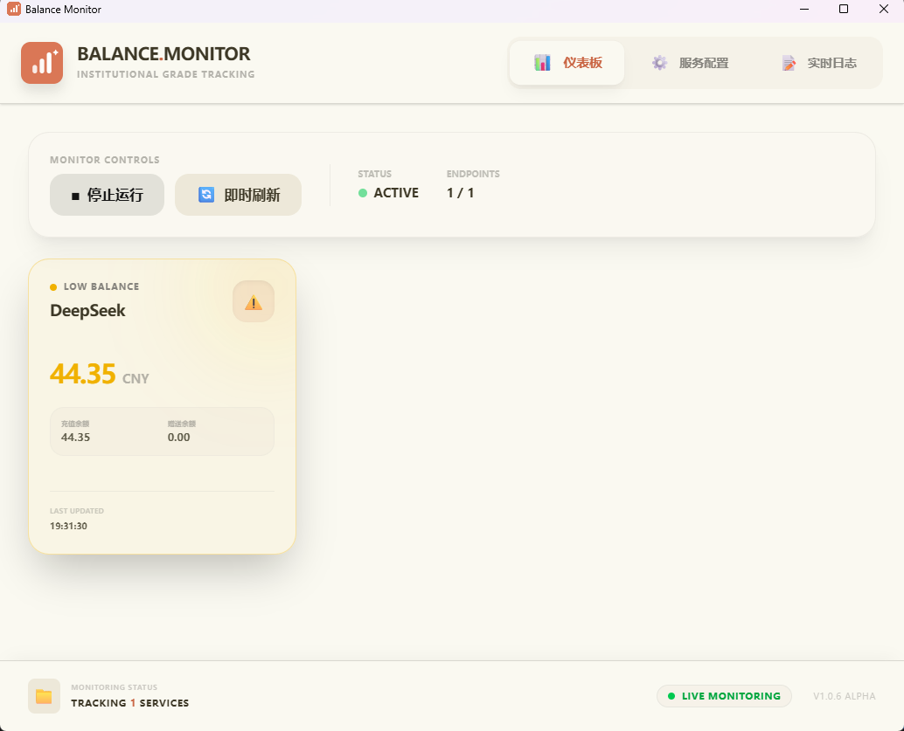
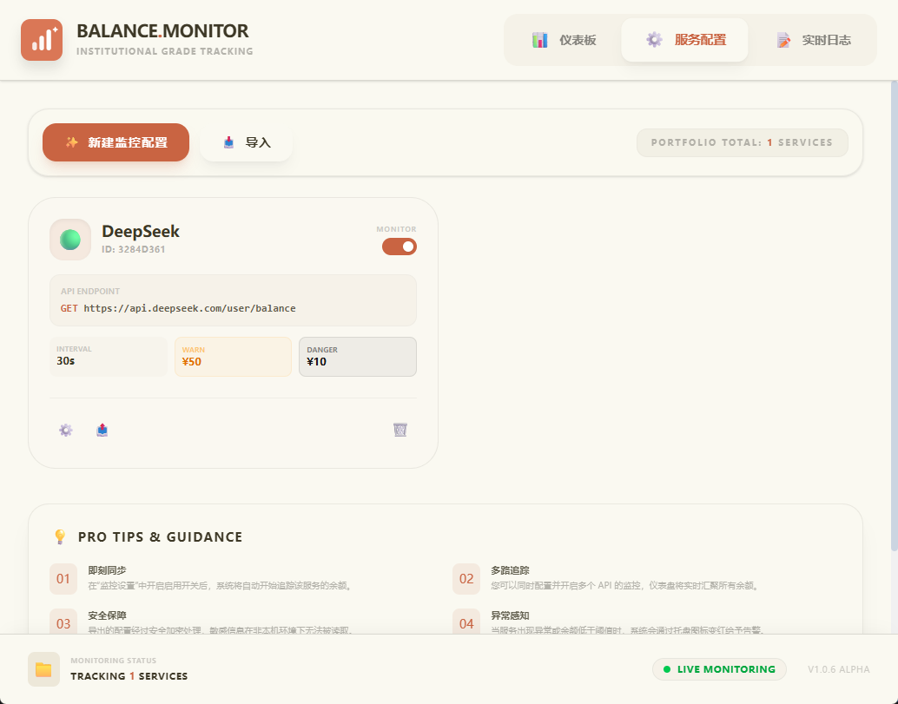
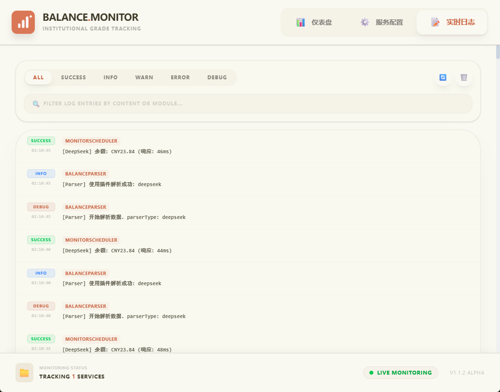

# Balance Monitor - 余额监控器

<div align="center">
  
</div>

一个跨平台的桌面应用程序，用于监控API端点的余额数据。基于Electron、React和TypeScript构建。


## 应用截图

### 仪表盘界面


### 服务配置界面


### 日志查看界面


## 功能特性

- 🔍 **API监控**：定时监控任意HTTP API端点的余额数据
- 📊 **智能解析**：基于XPath的响应提取，支持JSON路径
- 🔔 **系统托盘**：后台监控，余额变化时托盘通知
- ⚙️ **多配置支持**：支持多个API配置，轻松切换
- 🎯 **实时测试**：内置API连接测试和解析器验证
- 📋 **日志管理**：完整的日志系统，带查看界面
- 🖥️ **跨平台**：支持Windows、macOS和Linux

## 技术栈

- **框架**：Electron 39.2.6 + electron-vite
- **前端**：React 19.2.1 + TypeScript
- **样式**：TailwindCSS 4.1.18
- **构建工具**：electron-vite 5.0.0
- **包管理器**：npm

## 项目结构

```
├── src/
│   ├── main/           # Electron主进程 (Node.js)
│   │   ├── index.ts           # 应用入口点
│   │   ├── config-manager.ts  # 配置管理
│   │   ├── monitor-scheduler.ts # 定时监控
│   │   ├── api-engine.ts      # HTTP API请求
│   │   ├── balance-parser.ts  # 响应解析
│   │   ├── logger.ts          # 应用日志
│   │   └── tray-manager.ts    # 系统托盘集成
│   ├── preload/        # 预加载脚本 (IPC桥接)
│   └── renderer/       # React前端
│       ├── src/
│       │   ├── components/    # React UI组件
│       │   ├── hooks/         # 自定义React钩子
│       │   └── types/         # TypeScript类型定义
├── .github/workflows/  # CI/CD配置
└── resources/          # 静态资源
```

## 开发

### 环境要求

- Node.js 20+
- npm
- Windows、macOS或Linux系统

### 安装

```bash
# 克隆仓库
git clone https://github.com/cherry-min/balance-monitor.git
cd balance-monitor

# 安装依赖
npm install
```

### 开发模式

```bash
# 启动开发服务器（带热重载）
npm run dev
```

### 代码质量

```bash
# 类型检查
npm run typecheck      # 检查主进程和渲染进程类型

# 代码检查
npm run lint           # 运行ESLint

# 代码格式化
npm run format         # 使用Prettier格式化代码
```

### 测试

使用应用程序UI中的内置测试功能：

- **测试API连接**：验证端点连通性
- **测试解析器**：使用示例响应验证数据提取

## 构建

### 平台特定构建

```bash
# Windows构建（创建安装程序）
npm run build:win

# macOS构建
npm run build:mac

# Linux构建（多种格式）
npm run build:linux

# 解压版本构建（用于开发/调试）
npm run build:unpack
```

### 一键构建

```bash
# 完整构建（包含类型检查）
npm run build
```

构建输出位于`dist/`目录。

## CI/CD

本项目包含GitHub Actions工作流（`.github/workflows/build.yml`），当推送到`master`分支时会自动为所有平台构建和发布。

## 配置

配置文件存储在：

- **Windows**：`C:\Users\{USER}\AppData\Roaming\my-app\configs\`
- **Linux/macOS**：`~/.config/my-app/configs/`

功能：

- 多配置支持
- 活动配置切换
- 导入/导出功能
- 自动备份

## IPC通信

**主进程 → 渲染进程：**

- `balance-update`：余额数据更新
- `status-change`：监控状态变化
- `app-ready`：应用初始化完成

**渲染进程 → 主进程：**

- 配置管理（CRUD操作）
- API测试和验证
- 日志检索和管理
- 窗口控制

## 推荐IDE设置

- **[VSCode](https://code.visualstudio.com/)** 配合扩展：
  - [ESLint](https://marketplace.visualstudio.com/items?itemName=dbaeumer.vscode-eslint)
  - [Prettier](https://marketplace.visualstudio.com/items?itemName=esbenp.prettier-vscode)
  - [TypeScript Hero](https://marketplace.visualstudio.com/items?itemName=rbbit.typescript-hero)
  - [Tailwind CSS IntelliSense](https://marketplace.visualstudio.com/items?itemName=bradlc.vscode-tailwindcss)

## 许可证

本项目采用MIT许可证 - 详见[LICENSE](LICENSE)文件。

## 贡献

欢迎贡献！请随时提交Pull Request。

## 作者

**Cherry** - [GitHub个人主页](https://github.com/cherry-min)

**项目主页**：https://github.com/cherry-min/balance-monitor

---

## 更新日志

### [1.0.7] - 2025-12-28
- **文档增强**: 添加中文文档和应用程序截图
- **截图系统**: 添加仪表盘、服务配置和日志查看器截图
- **更新系统**: 建立标准化的更新记录和发布说明系统
- [查看完整发布说明](doc/changelog/release-notes-v1.0.7.md)

### [1.0.4] - 2025-12-28
- **核心API引擎**: 改进配置加密/解密逻辑
- **监控状态同步**: 修复监控状态同步问题
- **UI/UX优化**: 增强仪表盘和配置界面
- [查看完整发布说明](doc/changelog/release-notes-v1.0.4.md)

### [1.0.3] - 2025-12-28
- **初始版本**: Balance Monitor桌面应用程序
- **核心功能**: API监控、智能解析、系统托盘通知
- **多配置支持**: 支持多个API配置
- **跨平台**: 支持Windows、macOS和Linux

查看完整版本历史，请参阅[CHANGELOG.md](doc/changelog/CHANGELOG.md)