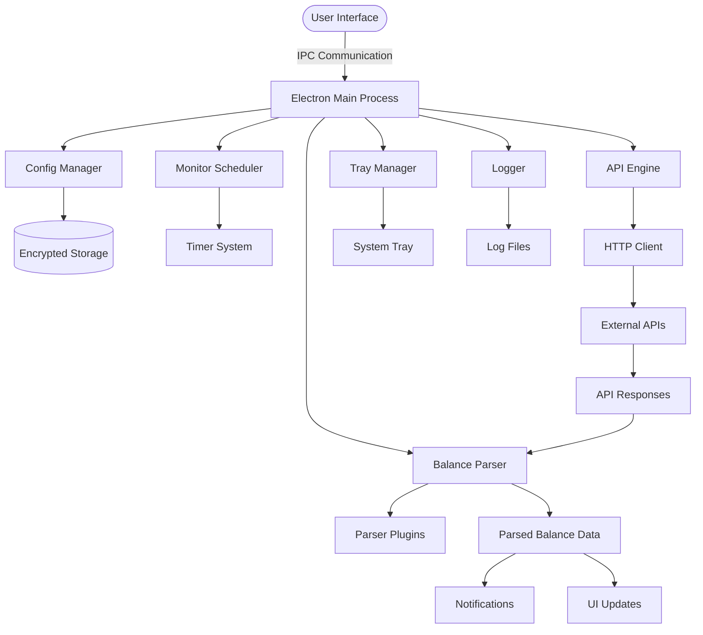

# Balance Monitor 🚀
> Professional API Balance Monitoring & Alert System (v1.1.2)

<div align="center">
  

  <h3>Your Personal API Balance Monitoring Assistant</h3>
  <p>Real-time monitoring, smart parsing, and instant notifications for API balance data.</p>

  <p>
    <a href="https://github.com/cherry-min/balance-monitor">
      
    </a>
    
    
    
    
  </p>

  <p>
    <a href="#-features">Features</a> •
    <a href="#-gui-overview">GUI Overview</a> •
    <a href="#-architecture">Architecture</a> •
    <a href="#-installation">Installation</a> •
    <a href="#-quick-start">Quick Start</a>
  </p>

  <p>
    <strong>English</strong> |
    <a href="README.md">简体中文</a>
  </p>
</div>

---

**Balance Monitor** is a professional cross-platform desktop application designed for developers, API service providers, and businesses that rely on API services with usage quotas. It provides real-time monitoring, intelligent data parsing, and instant notifications for API balance data, helping you avoid service interruptions due to insufficient quotas.

## 🌟 Features {#-features}

### 1. 🎛️ Smart Dashboard & Monitoring

* **Real-time Balance Display**: Monitor multiple API configurations simultaneously with clear visual indicators
* **Status Overview**: Quick view of all monitored services with color-coded status indicators (Active/Inactive/Error)
* **Historical Trends**: Track balance changes over time with intuitive charts and graphs
* **One-click Control**: Enable/disable monitoring for individual services with a single click

### 2. 🔧 Advanced Configuration Management

* **Multi-API Support**: Configure and monitor multiple API endpoints from different providers
* **Flexible Scheduling**: Set custom monitoring intervals from 1 minute to 24 hours
* **Preset Templates**: Pre-configured templates for popular API providers (DeepSeek, Moonshot, OpenRouter, VolcEngine, etc.)
* **Secure Storage**: Encrypted configuration storage with automatic backups
* **Import/Export**: Easily migrate configurations between devices or share with team members

### 3. 🧠 Intelligent Balance Parsing Engine

* **Multi-format Support**: Parse balance data from JSON, XML, HTML, and plain text responses
* **XPath & JSONPath**: Advanced data extraction using XPath for XML/HTML and JSONPath for JSON responses
* **Plugin Architecture**: Extensible parser system with vendor-specific plugins for accurate data extraction
* **Real-time Testing**: Test API connections and parser configurations before enabling monitoring
* **Error Handling**: Smart error detection and graceful degradation for parsing failures

### 4. 🔔 Smart Notification System

* **System Tray Integration**: Background monitoring with system tray icon and notifications
* **Multi-level Alerts**: Configure different alert thresholds for warning and critical levels
* **Custom Notifications**: Set up personalized notification messages for balance changes
* **Cross-platform**: Works seamlessly on Windows, macOS, and Linux systems
* **Tray Menu**: Quick access to dashboard, configuration, and logs from system tray

### 5. 📊 Comprehensive Logging & Analytics

* **Structured Logging**: Detailed logs of all monitoring activities, API calls, and parsing results
* **Log Viewer**: Built-in log viewer with filtering, search, and export capabilities
* **Performance Metrics**: Track API response times, success rates, and error patterns
* **Data Export**: Export monitoring data for external analysis or reporting

### 6. 🔐 Security & Reliability

* **Encrypted Storage**: Sensitive API keys and configuration data stored with encryption
* **Auto-backup**: Automatic backup of configurations to prevent data loss
* **Error Recovery**: Automatic retry mechanisms for failed API calls
* **Resource Efficient**: Low system resource usage for continuous background monitoring

## 🖼️ GUI Overview {#-gui-overview}

### Dashboard Interface


### Service Configuration Interface


### Log Viewer Interface


## 🏗️ Architecture {#-architecture}



### Three-Process Architecture

1. **Main Process** (`src/main/`): Core application logic, system tray, scheduling, IPC handlers
   * `config-manager.ts`: Configuration CRUD operations with encryption
   * `monitor-scheduler.ts`: Scheduled monitoring execution with timer management
   * `api-engine.ts`: HTTP API request execution and testing
   * `balance-parser.ts`: Response parsing with XPath/JSONPath support
   * `tray-manager.ts`: System tray icon and context menu
   * `logger.ts`: Structured logging system with log rotation

2. **Preload Script** (`src/preload/`): Secure bridge between main and renderer processes
   * Exposes safe APIs to renderer process
   * Type-safe IPC communication

3. **Renderer Process** (`src/renderer/`): React-based user interface
   * React hooks for Electron API integration
   * Zustand state management
   * TailwindCSS for styling
   * Real-time data updates via IPC

## 📥 Installation {#-installation}

### Option A: Download Pre-built Binaries

Download the latest release from [GitHub Releases](https://github.com/cherry-min/balance-monitor/releases):

* **Windows**: `.exe` installer or portable `.zip`
* **macOS**: `.dmg` package
* **Linux**: `.deb`, `.rpm`, or `AppImage`

### Option B: Build from Source

#### Prerequisites

* Node.js 20+
* npm
* Git

#### Build Steps

```bash
# Clone the repository
git clone https://github.com/cherry-min/balance-monitor.git
cd balance-monitor

# Install dependencies
npm install

# Development mode (with hot-reload)
npm run dev

# Build for production
npm run build

# Platform-specific builds
npm run build:win    # Windows
npm run build:mac    # macOS
npm run build:linux  # Linux
```

## 🚀 Quick Start {#-quick-start}

### 1. Adding Your First API Configuration

1. Open Balance Monitor application
2. Click "Add Configuration" button
3. Fill in the configuration details:
   * **Name**: Descriptive name for your API
   * **API Endpoint**: URL to check balance
   * **Request Method**: GET or POST
   * **Headers**: Authentication headers (API keys, etc.)
   * **Request Body**: For POST requests
   * **Monitoring Interval**: How often to check (e.g., 5 minutes)

### 2. Configuring Balance Parser

1. Select a **Parser Type**:
   * **JSON Path**: For JSON responses (e.g., `$.data.balance`)
   * **XPath**: For XML/HTML responses (e.g., `//balance/text()`)
   * **Regex**: For text responses
   * **Plugin**: Use vendor-specific parser

2. **Test the Parser**:
   * Click "Test Connection" to verify API connectivity
   * Click "Test Parser" with sample response to validate parsing
   * Adjust parser configuration until balance is correctly extracted

### 3. Setting Up Notifications

1. Configure **Alert Thresholds**:
   * **Warning Level**: When balance drops below this value
   * **Critical Level**: When immediate action is required

2. Enable **System Tray Notifications**:
   * Application runs in background
   * Shows system tray icon
   * Displays notifications for balance changes

### 4. Monitoring Multiple APIs

1. Add additional configurations for each API service
2. Organize configurations by vendor or purpose
3. Enable/disable monitoring individually as needed
4. View all balances on the unified dashboard

## 🔌 Integration Examples

### Example: Monitoring DeepSeek API Balance

```json
{
  "name": "DeepSeek API",
  "endpoint": "https://api.deepseek.com/user/balance",
  "method": "GET",
  "headers": {
    "Authorization": "Bearer YOUR_API_KEY",
    "Content-Type": "application/json"
  },
  "parser": {
    "type": "json",
    "path": "$.data.balance"
  },
  "interval": 300,  // 5 minutes
  "alerts": {
    "warning": 10,
    "critical": 1
  }
}
```

### Example: Monitoring OpenRouter API with POST

```json
{
  "name": "OpenRouter",
  "endpoint": "https://openrouter.ai/api/v1/auth/key",
  "method": "POST",
  "headers": {
    "Authorization": "Bearer YOUR_API_KEY"
  },
  "body": {},
  "parser": {
    "type": "json",
    "path": "$.data.credits"
  },
  "interval": 600  // 10 minutes
}
```

## 📝 Changelog

### [1.1.2] - 2025-12-31

* **Balance Parser Plugin System**: Complete refactoring to plugin architecture
* **Vendor-specific Parsers**: Added plugins for DeepSeek, Moonshot, OpenRouter, VolcEngine, PPIO, and AIHubMix
* **Shared Parser Types**: Unified type definitions across main and renderer processes
* **UI Enhancements**: Improved template selection and vendor search functionality
* **Performance Optimization**: Reduced memory usage and improved parsing speed

### [1.0.7] - 2025-12-28

* **Documentation Enhancement**: Added comprehensive Chinese documentation
* **Screenshots**: Added dashboard, service configuration, and log viewer screenshots
* **Update System**: Established standardized changelog and release notes system

### [1.0.4] - 2025-12-28

* **Core API Engine**: Improved configuration encryption/decryption logic
* **Monitoring Sync**: Fixed monitoring state synchronization issues
* **UI/UX Optimization**: Enhanced dashboard and configuration interfaces

### [1.0.3] - 2025-12-28

* **Initial Release**: Balance Monitor desktop application
* **Core Features**: API monitoring, smart parsing, system tray notifications
* **Multi-config Support**: Support for multiple API configurations
* **Cross-platform**: Windows, macOS, and Linux support

For complete version history, see [CHANGELOG.md](doc/changelog/CHANGELOG.md)

---

## 👥 Contributors

[](https://github.com/RadishoNeo/balance-monitor/graphs/contributors)

---

<div align="center">
  <p>If you find this tool helpful, please give it a ⭐️ on GitHub!</p>
  <p>Copyright © 2025 Balance Monitor Team.</p>
</div>
